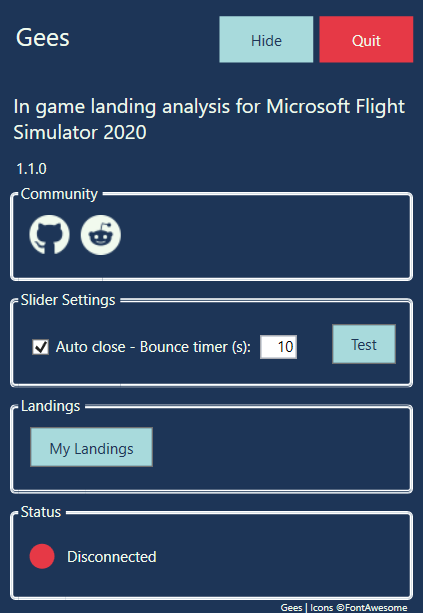
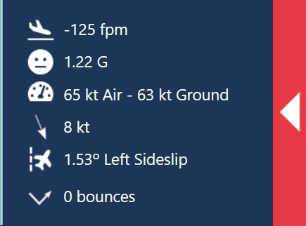
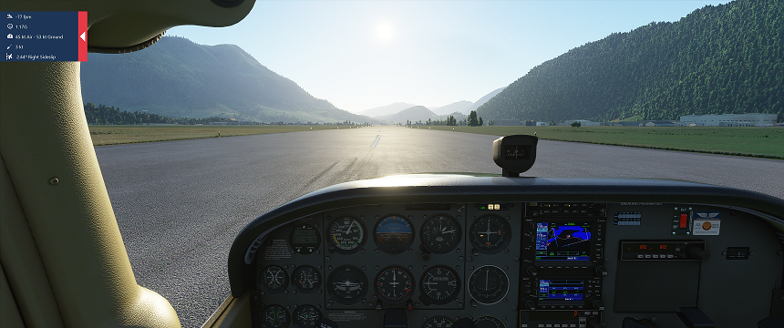

<!-- PROJECT LOGO -->
<br />
<p align="center">
  

  <h1 align="center">Gees</h3>

  <p align="center">
  In game landing analysis for Microsoft Flight Simulator 2020.
</p>

## Update
**Finally, the app reads the landing rate from the sim itself. It should be the same as in landing challenges**. 

For changelogs, please check the [releases](https://github.com/scelts/msfslandingrate/releases).

## How to Install/Use?
Download the latest release from [here](https://github.com/scelts/msfslandingrate/releases) (Assets -> File-that-is-not-source-code.zip). Unzip to your favorite location for MSFS2020 landing monitors, and start ```Gees.exe```. 
You'll see a window like this in the bottom right. 



The app itself runs in the background, and you can find this status window in the status tray, as this icon:


That's it. When you start the sim the app will automatically connect and when you land, you'll get a window similar to this slide out top-left:




You can start it before, or after the MSFS, it doesn't matter.

## How to Uninstall?
Delete the folder where the Gees.exe resides.
## What is measured?
### Descent rate at the landing in feet per minute
Self explanatory.

~~This is calculated by queriing the aircraft distance from the ground over time, every 20ms. After touchdown is detected, one takes the average descent rate in the last 100ms of flight.~~
> ~~The landing rate might differ a bit from the one in landing challenges. This is because I have no idea how Asobo calculates it, and I cannot query this value. Should be the same ballpark figure, it's anyway arbitrary how you do it.~~

> ~~You cannot query only the vertical rate. This was possible in FSX where you have "flat" runways, but if the runway is sloping, this doesn't work.~~

> You can query it, it was just well hidden. I mean, really well. Who knows what else is there.
### G force at the touchdown
Average G force at which the airplane is subjected 100ms after landing. Should be in theory related to the descent rate, undercarriage dampers and how much the passengers are nervous.
### Airspeed and ground speed at the touchdown
Self explanatory.
### Wind speed and direction at the touchdown
There's a nice arrow, showing where the wind is blowing from
### Sideslip at the touchdown
Did you do the proper de-crab maneuver, or the plane is going sideways on touchdown in the crosswind? The higher, the worse. Keep it close to 0 degrees or you might break the gear, or pop the tire (well, probably not in the sim).

## How to compile it
It's a c# WPF application. You'll need a Visual Studio with .NET 4.7 and the following nuget libraries:
```
CTrue.FsConnect
Octokit
PrettyBin
CsvHelper
```
## Contact
Use the [reddit page](https://www.reddit.com/r/MSFS2020LandingRate), or here, the [Issues page](https://github.com/scelts/msfslandingrate/issues) to report bugs and suggestions. Please do.


## License
Distributed under the GNU General Public License v3.0 License. See `LICENSE` for more information. (Whatever you do with this, keep it open source)
